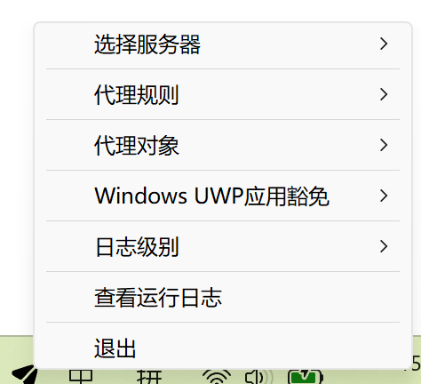
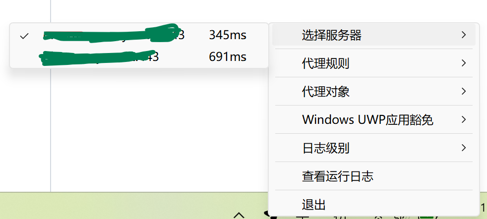

# Easyss

Easyss是一款兼容socks5的安全代理上网工具，目标是使访问国外技术网站更流畅免受干扰。

有报道表明访问国外技术网站正变得越来越困难，即使用了一些常用代理技术也面临被干扰的可能性。
为了以防万一，提前准备，重新实现了一套协议以加快访问速度和对抗嗅探。

**当前master分支，对应全新的版本v3，v3内核进行了完全的重构。性能和稳定性都有大幅提升，欢迎下载v3最新rc版本进行测试。 如需v2文档请[点击](https://github.com/nange/easyss/tree/v2)**

## 特性

* 简单稳定易用, 没有复杂的配置项；支持 IPv4/IPv6 双栈网络
* 无流量特征，不易被嗅探；底层基于真实http2(tls)传输协议，并对请求进行流量整形，真实网页fallback等手段，保证网络的稳定运行
* 全平台支持(Linux, MacOS, Windows, Android等)
* 支持SOCKS5(TCP/UDP, thanks [socks5](https://github.com/txthinking/socks5))、HTTP 代理协议
* 支持浏览器级别代理(设置系统代理), 和系统全局代理(thanks [tun2socks](https://github.com/xjasonlyu/tun2socks)); 全局代理支持`ping`命令(ICMP Echo协议)
* 支持系统托盘图标管理客户端 (thanks [systray](https://github.com/getlantern/systray))
* 可配置多服务器切换; 自定义直连、代理白名单(IP/域名)
* 支持服务端链式代理

## 下载

### 在release页面直接下载(各平台)编译好的二进制文件

[去下载](https://github.com/nange/easyss/releases)

如果想通过源码编译，可查看`Makefile`中的内容，注意Linux平台需要依赖`libgtk-3-dev libayatana-appindicator3-dev`。

## 用法

### 客户端

创建配置文件：`config.json`，并把配置文件放入`easyss`二进制相同目录中。

Easyss v3 支持两种配置模式，自动识别：

* **简化模式**：扁平 JSON 格式，兼容 v2 配置，适合大多数用户
* **完整模式**：嵌套 JSON 格式，支持多服务器等高级功能，通过 `version: 3` 标识

---

#### 简化模式（推荐, 兼容v2）

只包含最常用的配置项，适合简单使用，仅支持配置单一服务器：

```json
{
  "server": "your-domain.com",
  "server_port": 443,
  "password": "your-password",
  "local_port": 2080,
  "method": "aes-256-gcm",
  "proxy_rule": "auto",
  "timeout": 30,
  "bind_all": false,
  "outbound_proto": "native",
  "direct_file": "",
  "proxy_file": "",
  "log_level": "info",
  "log_file_path": "easyss.log",
}
```

**简化模式参数说明：**

| 参数 | 必填 | 默认值 | 说明 |
|---|---|---|---|
| `server` | 是 | - | 服务器地址（域名或IP） |
| `server_port` | 是 | - | 服务器端口 |
| `password` | 是 | - | 通信加密密钥 |
| `local_port` | 否 | 2080 | 本地 SOCKS5 监听端口。`http_port` 自动设为 `local_port + 1000` |
| `method` | 否 | aes-256-gcm | 加密方式，可选: `aes-256-gcm`, `chacha20-poly1305` |
| `proxy_rule` | 否 | auto | 代理规则，可选: `auto`, `reverse_auto`, `proxy`, `direct`, `auto_block` |
| `timeout` | 否 | 30 | 超时时间，单位秒 |
| `bind_all` | 否 | false | 是否将监听端口绑定到所有本地 IP |
| `outbound_proto` | 否 | native | 出口协议，可选: `native`, `h2`（效果相同，均为 HTTP/2） |
| `log_level` | 否 | info | 日志级别，可选: `debug`, `info`, `warn`, `error` |
| `log_file_path` | 否 | 空 | 日志文件路径，为空则输出到标准输出 |
| `direct_file` | 否 | 空 | 自定义直连文件路径（IP/CIDR/域名/正则混写，每行一条，支持 `regexp:` 和 `*` 通配符） |
| `proxy_file` | 否 | 空 | 自定义代理文件路径（IP/CIDR/域名/正则混写，每行一条，支持 `regexp:` 和 `*` 通配符） |

除 3 个必填参数外，其他均为可选。以上未列出的字段（如 `sn`, `ca_path`, `http_port`, `ipv6_rule`, `enable_quic` 等）也可在简化模式中使用，会自动迁移到 v3 完整格式。

执行以下命令可查看简化模式示例：

```bash
./easyss -show-config-example-simple
```

**简化模式命令行参数：**

简化模式的配置项也可通过命令行参数指定，优先级高于配置文件：

| 参数 | 说明 |
|---|---|
| `-s` | 服务器地址 |
| `-p` | 服务器端口 |
| `-k` | 通信加密密钥 |
| `-l` | 本地 SOCKS5 端口 |
| `-m` | 加密方式 |
| `-proxy-rule` | 代理规则 |
| `-t` | 超时时间（秒） |
| `-outbound-proto` | 出口协议 |
| `-log-level` | 日志级别 |
| `-sn` | TLS SNI 覆盖 |
| `-enable-quic` | 启用 QUIC 协议 |
| `-ipv6-rule` | IPv6 规则 |
| `-direct-file` | 自定义直连文件路径 |
| `-proxy-file` | 自定义代理文件路径 |

示例：

```bash
./easyss -c config.json -s my-server.com -p 443 -k mypass -l 1080
```

---

#### 完整模式

支持所有 v3 高级功能（多服务器、流量整形、传输层调参等）：

```json
{
  "version": 3,
  "servers": [{
    "address": "your-domain.com",
    "port": 443,
    "password": "your-password",
    "method": "aes-256-gcm",
    "sn": "",
    "ca_path": "",
    "default": true
  }],
  "local": {
    "socks_port": 2080,
    "http_port": 3080,
    "bind_all": false,
    "disable_sys_proxy": false,
    "enable_forward_dns": false,
    "enable_tun2socks": false,
    "enable_quic": false,
    "tun_config": {}
  },
  "routing": {
    "proxy_rule": "auto",
    "ipv6_rule": "auto",
    "direct_file": "",
    "proxy_file": ""
  },
  "transport": {
    "protocol": "h2",
    "endpoint_prefix": "/v3",
    "conn_count_max": 6,
    "stream_threshold": 8
  },
  "shaper": {
    "batch_window_ms": 3,
    "cover_budget_ratio": 0.05,
    "cover_budget_cap": 131072
  },
  "log": {
    "level": "info",
    "file_path": "easyss.log"
  },
  "timeout": 30,
  "auth_username": "",
  "auth_password": "",
  "pprof_enabled": false,
  "latency_offset_ms": 50
}
```

执行以下命令查看完整模式所有可配置字段：

```bash
./easyss -show-config-example
```

#### 配置模式自动识别

Easyss 通过检测配置文件自动区分模式：

* 包含 `"version": 3` 且 `servers` 非空 → **完整模式**
* 不包含 `version` 或 `servers` 为空 → **简化模式**（自动迁移到完整模式）

简化模式的配置会在加载时自动转换为完整模式，用户无需手动迁移。

---

保存好配置文件后，双击`easyss`，程序会自动启动，托盘会出现Easyss的图标，如下:






**注意：代理对象，选择系统全局流量时，需要管理员权限。**

**自定义直连/代理白名单：**

对于部分国内/国外的 IP 或域名，可能 `Easyss` 没有正确识别路由规则。可通过 `direct_file` 和 `proxy_file` 自定义。

在 `easyss` 所在目录下新建文本文件（如 `direct.txt`、`proxy.txt`），IP/CIDR/域名可混写，每行一条记录。然后在配置中指定路径：

**简化模式：**

```json
{
  "direct_file": "direct.txt",
  "proxy_file": "proxy.txt"
}
```

**完整模式：**

```json
"routing": {
  "direct_file": "direct.txt",
  "proxy_file": "proxy.txt"
}
```

也可通过命令行指定：

```bash
./easyss -direct-file direct.txt -proxy-file proxy.txt
```

`direct.txt` 示例（直连白名单，匹配到则不走代理）：

```text
39.156.66.10
110.242.68.66
106.11.84.3
206.0.68.0/23
baidu.com
taobao.com
your-custom-domain.com
*cn-*                    # glob 通配符：匹配所有包含 "cn-" 的域名
regexp:^.*\.mycdn\.com$  # 正则表达式：匹配 mycdn.com 及其子域名
```

`proxy.txt` 示例（代理白名单，匹配到则强制走代理）：

```text
1.2.3.4
10.0.0.0/8
google.com
twitter.com
*google*                 # glob 通配符：匹配所有包含 "google" 的域名
regexp:^.*\.youtube\..*$ # 正则表达式：匹配包含 .youtube. 的域名
```

**匹配规则：**

* 每行自动识别类型（按优先级）：
    1. `regexp:` 前缀 → Go 正则表达式匹配
    2. 包含 `*` → glob 通配符匹配（`*` 匹配任意字符序列）
    3. IP → 精确匹配
    4. CIDR → 网段匹配
    5. 其他 → 域名匹配（支持子域名）
* 域名支持子域名匹配（如配置 `google.com`，则 `www.google.com`、`mail.google.com` 也会匹配）
* 路由优先级：自定义直连 > 自定义代理 > auto/geo 规则

### 手机客户端

手机客户端EasyssTun.apk文件可直接在[release页面](https://github.com/nange/easyss/releases)下载。

注意: 可将常用的国内大流量APP勾选上跳过，这样可减少电量消耗。当然不选也没关系，Easyss会自动判断该直连还是走代理。

### 服务器端

和客户端一样, 同样先创建配置文件`config.json`，并配置文件和二进制`easyss-server`放同一目录中。

**服务端配置文件示例：**

```json
{
  "version": 3,
  "server": {
    "listen": ":443",
    "domain": "your-domain.com",
    "password": "your-pass",
    "allowed_methods": ["aes-256-gcm", "chacha20-poly1305"],
    "cert_path": "",
    "key_path": "",
    "email": "your-email",
    "fallback_target": "",
    "fallback_preserve_host": false,
    "fallback_cdn_domains": [],
    "batch_window_ms": 3,
    "cover_budget_ratio": 0.03,
    "cover_budget_cap": 131072
  },
  "log": {
      "level": "info",
      "file_path": "easyss.log"
  },
  "timeout": 30
}
```

**参数说明：**

| 参数 | 必填 | 默认值 | 说明 |
|---|---|---|---|
| `server.listen` | 是 | - | 服务器监听地址，如 `:443` |
| `server.domain` | 否 | - | 服务器域名（未使用自定义证书时必填，用于自动获取 Let's Encrypt 证书） |
| `server.password` | 是 | - | 通信加密密钥 |
| `server.allowed_methods` | 否 | aes-256-gcm, chacha20-poly1305 | 允许的加密方式列表 |
| `server.cert_path` | 否 | - | 自定义证书文件路径（不为空则使用自定义证书） |
| `server.key_path` | 否 | - | 自定义证书密钥文件路径 |
| `server.email` | 否 | 随机生成 | 用于自动获取证书的邮箱地址 |
| `server.fallback_target` | 否 | - | 回落目标，自动识别类型：<br>**空**: 使用内置主题页面<br>**URL** (`http://`或`https://`开头): 反向代理到上游 HTTP 服务<br>**目录**: 根据 URL path 匹配 HTML 文件（如 `/about` → `about.html`）<br>**文件**: 所有路径返回同一 HTML 页面 |
| `server.fallback_preserve_host` | 否 | false | 仅对 `fallback_target` 为 URL 生效。<br>**false**: 转发给上游的 Host 头设为上游主机（默认，适合 GitHub 等会校验 Host 的公网站点）<br>**true**: 透传客户端原始 Host 给上游（适合本地 nginx 依赖 `server_name` 做虚拟主机路由的场景） |
| `server.fallback_cdn_domains` | 否 | [] | 仅对 `fallback_target` 为 URL 生效。<br>配置需要通过代理中转的 CDN 域名列表（如 `["github.githubassets.com"]`）。HTML 和 CSP 中引用这些域名的绝对 URL 会被重写为 `/__cdn__/<host>/...` 路径前缀形式，浏览器请求时走代理转发到对应 CDN，避免直连 CDN 暴露真实 IP 或被 CSP 拦截 |
| `server.batch_window_ms` | 否 | 3 | 流量整形批处理窗口，单位毫秒，范围 1-10 |
| `server.cover_budget_ratio` | 否 | 0.03 | cover traffic 占真实流量的预算比例，设为 0 或负数使用默认值，范围 (0, 1] |
| `server.cover_budget_cap` | 否 | 131072 | cover traffic 最大累积预算，单位字节，默认 128KB |
| `timeout` | 否 | 30 | 超时时间，单位秒 |

> **fallback_target 使用示例**：
>
> ```json
> // 1. 空值 → 内置主题页面（默认）
> "fallback_target": ""
>
> // 2. 反向代理到本地 nginx（透传原始 Host，匹配 server_name 路由）
> "fallback_target": "http://127.0.0.1:8080",
> "fallback_preserve_host": true
>
> // 3. 反向代理到公网站点（如 GitHub）
> //    自动重写 Host 头避免 301，并重写 HTML 中的绝对 URL，
> //    修复 release assets 等动态加载的 CSP 问题
> //    配置 CDN 域名让静态资源也走代理
> "fallback_target": "https://github.com",
> "fallback_cdn_domains": ["githubassets.com", "githubusercontent.com"]
> // fallback_preserve_host 默认 false 即可
>
> // 4. 单文件 → 所有路径返回同一页面
> "fallback_target": "/var/www/fallback.html"
>
> // 5. 目录 → 按 URL path 匹配 HTML 文件
> "fallback_target": "/var/www/fallback/"
> ```
>
> **URL 模式行为说明**：当 `fallback_target` 为 URL 时，反向代理会自动执行以下处理，无需额外配置：
>
> * 设置上游 Host 头（避免 GitHub 等站点返回 301 到规范主机）
> * 重写 3xx `Location` 响应头中指向上游的绝对 URL 为客户端面向地址
> * 重写 HTML 响应体和 `Content-Security-Policy` 头中指向上游的绝对 URL（如 turbo-frame 的 `src`），使页面内动态请求留在代理上，避免 CSP 拦截
> * 重写 `Set-Cookie` 的 `Domain` 属性，使浏览器接受 cookie（修复 CSRF 422）
> * 重写请求 `Origin`/`Referer` 头为上游地址（修复 CSRF 422）
> * 对上游请求 `Accept-Encoding` 与客户端取交集，gzip 响应自动解压后重写、再按客户端能力重新压缩
> * 配置了 `fallback_cdn_domains` 时，HTML/CSP 中引用这些 CDN 域名的 URL 被重写为 `/__cdn__/<host>/...`，浏览器请求经代理转发到对应 CDN
>
> **目录模式**：目录结构如下（优先级: 反向代理 > 目录 > 单文件 > 内置主题）：
>
> ```
> /var/www/fallback/
> ├── index.html          → /
> ├── about.html          → /about
> ├── contact.html        → /contact
> ├── 404.html            → 未匹配路径
> └── blog/
>     ├── index.html      → /blog
>     └── post1.html      → /blog/post1
> ```

执行:

```sh
./easyss-server  # 前台运行
nohup ./easyss-server > easyss-server.log 2>&1  # 后台运行
```

**注意：在没有使用自定义证书情况下，服务器的443端口必须对外可访问，用于自动获取服务器域名证书的TLS校验使用；
同时需要sudo权限运行`easyss-server`。如果需要支持`ping`命令，也需要sudo权限运行`easyss-server`。**

#### docker部署

docker run -d --name easyss --network host nange/docker-easyss:latest -p yourport -k yourpassword -s yourdomain.com

### 自定义证书

默认情况下，`easyss-server`端部署时配置了域名，则会自动从`Let's Encrypt`获取tls证书，用户无需操心证书配置。
但这要求我们必须有自己的域名，这加大了使用Easyss的难度。如果我们没有自己的域名，也可以通过自定义tls证书来使用Easyss。

#### 生成自定义证书

可根据自己的需求，使用`openssl`等工具生成自定义证书。也可以参考： `./scripts/self_signed_certs` 目录示例，使用`cfssl`生成自定义证书。
示例就是使用IP而不是域名生成自定义证书，这样就可以无域名使用Easyss了。

## 高级用法

### 服务器部署在反向代理(或CDN)之后

Easyss v3 基于 HTTP/2 作为传输层协议，天然兼容反向代理和 CDN 部署。

将 Nginx、Cloudflare 等反向代理配置为将流量转发到 `easyss-server` 的监听端口即可。
客户端配置中填写反向代理的地址和端口，无需额外设置。

### 配置Cloudflare优选IP

可以把Cloudflare CDN作为反向代理，再将流量转发给Easyss,这样在很多时候能够改善我们的网络访问速度。
使用Cloudflare CDN通常会配合其优选IP同时使用，这样可以大幅提高访问速度和降低网络延迟。

在简化模式中，将 `server` 字段配置为优选IP，`sn` 字段配置为Cloudflare后台管理的域名即可。
在完整模式中，将 `servers[].address` 配置为优选IP，`servers[].sn` 配置为对应的域名。

### 作为透明代理将Easyss部署在路由器或者软路由上

直接将Easyss部署在路由器或这软路由上，可实现家里或公司网络自动透明代理，无需在终端设备上安装Easyss客户端。

在简化模式中设置 `enable_tun2socks: true` 和 `enable_forward_dns: true`。
在完整模式中设置 `local.enable_tun2socks: true` 和 `local.enable_forward_dns: true`。
也可通过命令行 `-enable-tun2socks=true` 开启全局代理。

根据情况判断是否需要开启ip转发:

```bash
# 编辑配置文件
vi /etc/sysctl.conf

# 找到并取消注释（或添加）以下行：
net.ipv4.ip_forward = 1

# 如果需要IPv6转发，也取消注释：
net.ipv6.conf.all.forwarding = 1

# 重新加载配置
sysctl -p
```

### 服务端链式代理

服务端(`easyss-server`)支持将请求再次转发给下一个代理(目前只支持`socks5`)。

在完整模式服务端配置中指定 `next_proxy`：

```json
{
    "next_proxy": {
        "url": "socks5://your-ip:your-port",
        "next_proxy_file": "next_proxy.txt",
        "enable_udp": false,
        "all_host": false
    }
}
```

* `next_proxy.url`: 下一级代理地址，格式 `socks5://ip:port`
* `next_proxy.next_proxy_file`: 指定走链式代理的 IP/CIDR/域名列表文件，每行一条记录，可混放
* `next_proxy.enable_udp`: 是否转发UDP请求（需要下一级代理支持）
* `next_proxy.all_host`: 是否对所有请求走链式代理

如果未指定 `next_proxy_file`，则仅按 `all_host` 规则决定是否走链式代理。

## LICENSE

MIT License
