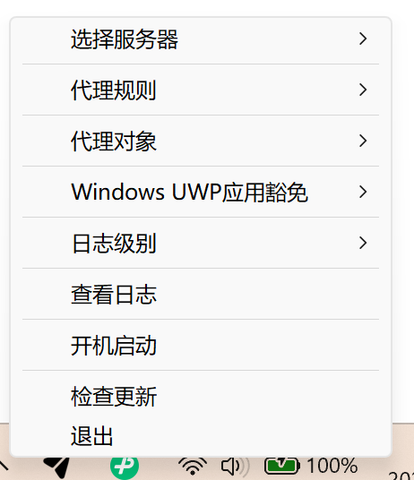
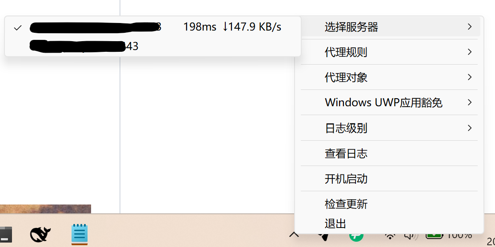

# Easyss

Easyss是一款兼容socks5的安全代理上网工具，目标是使访问国外技术网站更流畅免受干扰。

有报道表明访问国外技术网站正变得越来越困难，即使用了一些常用代理技术也面临被干扰的可能性。
为了以防万一，提前准备，重新实现了一套协议以加快访问速度和对抗嗅探。

**当前master分支，对应全新的版本v3，v3内核进行了完全的重构。性能和稳定性都有大幅提升，欢迎下载v3最新rc版本进行测试。 如需v2文档请[点击](https://github.com/nange/easyss/tree/v2)**

## 特性

* 简单稳定易用, 没有复杂的配置项；支持 IPv4/IPv6 双栈网络
* 无流量特征，不易被嗅探：底层基于真实 HTTP/2 (TLS) 传输协议，并通过流量整形、真实网页 fallback、智能请求连接调度等手段，兼顾连接隐蔽性与运行稳定性
* 全平台支持(Linux, MacOS, Windows, Android等)
* 支持SOCKS5(TCP/UDP, thanks [go-socks5](https://github.com/things-go/go-socks5))、HTTP 代理协议
* 支持浏览器代理(设置系统代理)与系统全局代理(thanks [tun2socks](https://github.com/xjasonlyu/tun2socks))，支持`ping`(ICMP Echo 协议)
* 支持系统托盘图标管理客户端 (thanks [systray](https://github.com/gogpu/systray))
* 可配置多服务器切换; 自定义直连、代理白名单(IP/域名)
* 支持服务端链式代理
* 支持节点组网(VPN)：多个 easyss 节点之间互相访问对端自身的服务端口，DERP 中继由 easyss 服务端内嵌，不依赖任何官方服务

## 下载

### 在release页面直接下载(各平台)编译好的二进制文件

[去下载](https://github.com/nange/easyss/releases)

**MacOS 用户注意：** `Easyss.app` 未经 Apple 公证，从网上下载解压后首次双击会被 Gatekeeper 拦截（提示无法验证开发者/应用已损坏）。**仅首次下载后**需要先在终端执行以下命令解除隔离属性，然后即可正常双击运行：

```bash
xattr -cr ./Easyss.app
```

命令行进入 `Easyss.app` 所在目录，并执行上述命令。（配置文件需与程序同目录，建议将 app 保留在自选目录而非 `/Applications`）。

之后使用客户端内置的自更新功能升级时，新版本会自动清除隔离属性，无需再手动执行 `xattr` 命令。

如果想通过源码编译，可查看`Makefile`中的内容。

## 用法

### 客户端

创建配置文件：`config.json`，并把配置文件放入`easyss`二进制相同目录中。

Easyss v3 支持两种配置模式，自动识别：

* **简化模式**：扁平 JSON 格式，兼容 v2 配置，适合大多数用户
* **完整模式**：嵌套 JSON 格式，支持多服务器等高级功能，通过 `version: 3` 标识

---

#### 简化模式（推荐, 兼容v2）

只包含最常用的配置项，适合简单使用，仅支持配置单一服务器（最简配置示例）：

```json
{
  "server": "your-domain.com",
  "server_port": 443,
  "password": "your-password",
  "local_port": 4080,
  "log_file_path": "easyss.log"
}
```

**简化模式参数说明（完整参数说明）：**

| 参数 | 必填 | 默认值 | 说明 |
| --- | --- | --- | --- |
| `server` | 是 | - | 服务器地址（域名或IP） |
| `server_port` | 是 | - | 服务器端口 |
| `password` | 是 | - | 通信加密密钥 |
| `local_port` | 否 | 4080 | 本地 SOCKS5 监听端口。`http_port` 自动设为 `local_port + 1000` |
| `method` | 否 | aes-256-gcm | 加密方式，可选: `aes-256-gcm`, `chacha20-poly1305` |
| `proxy_rule` | 否 | auto | 代理规则，可选: `auto`, `reverse_auto`, `proxy`, `direct`, `auto_block` |
| `timeout` | 否 | 30 | 基础超时时间，单位秒，取值范围 15-60（越界取边界值）；TCP/UDP 空闲、拨号、DNS 响应与连接轮换均由它派生（见"`timeout` 派生规则"） |
| `bind_all` | 否 | false | 是否将监听端口绑定到所有本地 IP |
| `outbound_proto` | 否 | native | 出口协议，可选: `native`, `h2`（效果相同，均为 HTTP/2） |
| `log_level` | 否 | info | 日志级别，可选: `debug`, `info`, `warn`, `error` |
| `log_file_path` | 否 | 空 | 日志文件路径，为空则输出到标准输出 |
| `direct_file` | 否 | 空 | 自定义直连文件路径（IP/CIDR/域名/正则混写，每行一条，支持 `regexp:` 和 `*` 通配符） |
| `proxy_file` | 否 | 空 | 自定义代理文件路径（IP/CIDR/域名/正则混写，每行一条，支持 `regexp:` 和 `*` 通配符） |

除 3 个必填参数外，其他均为可选。以上未列出的字段（如 `sn`, `ca_path`, `http_port`, `ipv6_rule`, `enable_quic` 等）也可在简化模式中使用，会自动迁移到 v3 完整格式。

执行以下命令可查看简化模式示例：

```bash
./easyss -show-config-example-simple
```

**简化模式命令行参数：**

简化模式的配置项也可通过命令行参数指定，优先级高于配置文件：

| 参数 | 说明 |
| --- | --- |
| `-s` | 服务器地址 |
| `-p` | 服务器端口 |
| `-k` | 通信加密密钥 |
| `-l` | 本地 SOCKS5 端口 |
| `-m` | 加密方式 |
| `-proxy-rule` | 代理规则 |
| `-t` | 超时时间（秒） |
| `-outbound-proto` | 出口协议 |
| `-log-level` | 日志级别 |
| `-sn` | TLS SNI 覆盖 |
| `-enable-quic` | 启用 QUIC 协议 |
| `-ipv6-rule` | IPv6 规则 |
| `-direct-file` | 自定义直连文件路径 |
| `-proxy-file` | 自定义代理文件路径 |

示例：

```bash
./easyss -c config.json -s my-server.com -p 443 -k mypass -l 1080
```

---

#### 完整模式

支持所有 v3 高级功能（多服务器、流量整形、传输层调参等）：

```json
{
  "version": 3,
  "servers": [{
    "address": "your-domain.com",
    "port": 443,
    "password": "your-password",
    "method": "aes-256-gcm",
    "sn": "",
    "ca_path": "",
    "default": true
  }],
  "local": {
    "socks_port": 4080,
    "http_port": 5080,
    "bind_all": false,
    "disable_sys_proxy": false,
    "enable_forward_dns": false,
    "enable_tun2socks": false,
    "enable_quic": false
  },
  "routing": {
    "proxy_rule": "auto",
    "ipv6_rule": "auto",
    "direct_file": "",
    "proxy_file": ""
  },
  "transport": {
    "protocol": "h2",
    "conn_count_max": 15,
    "stream_threshold": 4,
    "priority_slot_ratio": 0.4,
    "conn_max_bytes": 268435456
  },
  "shaper": {
    "batch_window_ms": 3,
    "cover_budget_ratio": 0.03,
    "cover_budget_cap": 16384
  },
  "log": {
    "level": "info",
    "file_path": "easyss.log"
  },
  "timeout": 30,
  "auth_username": "",
  "auth_password": "",
  "pprof_enabled": false
}
```

执行以下命令查看完整模式所有可配置字段：

```bash
./easyss -show-config-example
```

**transport 参数说明（默认值以代码为准，0 表示使用默认值）：**

| 参数 | 默认值 | 说明 |
| --- | --- | --- |
| `transport.protocol` | h2 | 传输协议（目前仅支持 h2） |
| `transport.conn_count_max` | 15 | 最大连接数，懒加载扩容的上限 |
| `transport.stream_threshold` | 4 | 活跃流达到该阈值且连接数未达上限时，新建连接 |
| `transport.priority_slot_ratio` | 0.4 | 优先（交互式）槽位占连接数的比例，其余为批量槽位 |
| `transport.conn_max_bytes` | 268435456 | 单连接双向累计最大字节数（256MB），0 使用默认值；超限后轮换连接 |

**`timeout` 派生规则（客户端与服务端共用，以代码为准）：**

| 派生项 | 公式 | 默认值（timeout = 30） |
| --- | --- | --- |
| TCP 流空闲超时 | 8 × timeout | 240s |
| UDP 会话空闲超时 | 2 × timeout | 60s |
| 出站拨号超时 | timeout ÷ 3，钳制在 [3s, 15s] | 10s |
| DNS 响应读取超时 | timeout ÷ 3 | 10s |
| 连接轮换生命周期（客户端） | 12 × timeout | 360s |
| h2 连接空闲超时（服务端） | 8 × timeout | 240s |

`timeout` 的取值范围为 **15-60** 秒（非正值取默认值 30，超出范围取最近的边界）：它派生出上表全部超时，过小会让空闲连接被频繁误杀、过大则让半开连接长时间占用资源。其中连接轮换到期后槽位停止接收新流、其空闲连接被关闭，下一条流重新拨号（对用户无感），**进行中的流永不被打断**。

**shaper 参数说明：**

| 参数 | 默认值 | 说明 |
| --- | --- | --- |
| `shaper.batch_window_ms` | 3 | 流量整形批处理窗口，单位毫秒，范围 1-10 |
| `shaper.cover_budget_ratio` | 0.03 | cover traffic 占真实流量的预算比例，范围 (0, 1] |
| `shaper.cover_budget_cap` | 16384 | cover traffic 最大累积预算，单位字节，默认 16KB |

#### 配置模式自动识别

Easyss 通过检测配置文件自动区分模式：

* 包含 `"version": 3` 且 `servers` 非空 → **完整模式**
* 不包含 `version` 或 `servers` 为空 → **简化模式**（自动迁移到完整模式）

简化模式的配置会在加载时自动转换为完整模式，用户无需手动迁移。

---

保存好配置文件后，双击`easyss`，程序会自动启动，托盘会出现Easyss的图标，如下:






**注意：代理对象，选择系统全局流量时，需要管理员权限。**

**开机自启动与网络尚未就绪：**

Easyss 支持开机自启动。开机时 WiFi/网络往往还没有初始化完成，此时客户端**不会启动失败**：服务端域名解析失败只会变成一条启动警告（托盘会提示"网络尚未就绪、已在后台重试"），SOCKS5/HTTP 代理端口照常监听，后台按退避持续重试解析，网络恢复后代理自动可用（并会再提示一次"网络已就绪"）。

如果配置了"系统全局流量(Tun2socks)"，网络未就绪时会**跳过 TUN**（此时启用会把系统 DNS 指向本机转发服务器却无法解析服务端域名）；托盘中的"系统全局流量"会保持未勾选，等网络恢复后在托盘菜单里重新开启即可。

**无托盘（headless）版本的系统代理：**

`easyss-headless`（以及 `easyss --disable-tray`）没有托盘菜单可以勾选"浏览器(设置系统代理)"，因此会在本地代理启动成功后**直接设置系统代理**（等价于该勾选项），并在收到退出信号时自动撤销。不需要它时，在配置里设置 `"disable_sys_proxy": true`（完整模式为 `local.disable_sys_proxy`）；通常只有改用 `enable_tun2socks` 做全局透明代理时才需要关掉。

两点需要注意：

* Linux 上设置 GNOME 代理走 `gsettings`，发布会话环境走 `systemctl --user` / `dbus-update-activation-environment`。以 root 或 systemd 系统服务方式运行时这些通常不可达，此时系统代理**不会**生效，日志里只留下 `[SYSPROXY]`/`[EASYSS-V3] set system proxy failed` 警告——这种部署请改用 `enable_tun2socks`（TUN）或手动配置代理。
* 进程被 `kill -9`（SIGKILL）或崩溃时来不及撤销，系统代理会残留并指向一个已经停止的本地端口，表现为"整机断网"。手动恢复（GNOME）：`gsettings set org.gnome.system.proxy mode 'none'`，然后重新启动 Easyss 即可。

**自定义直连/代理白名单：**

对于部分国内/国外的 IP 或域名，可能 `Easyss` 没有正确识别路由规则。可通过 `direct_file` 和 `proxy_file` 自定义。

在 `easyss` 所在目录下新建文本文件（如 `direct.txt`、`proxy.txt`），IP/CIDR/域名可混写，每行一条记录。然后在配置中指定路径：

> 配置中的相对路径（`direct_file`、`proxy_file`、`ca_path` 等）会先按当前工作目录查找，找不到时自动回退到 `easyss` 可执行文件所在目录（macOS 下为 `.app` 旁）。这样从 Finder 双击、开机自启（launchd）等方式启动时也能正常读取，不受启动目录影响。

**简化模式：**

```json
{
  "direct_file": "direct.txt",
  "proxy_file": "proxy.txt"
}
```

**完整模式：**

```json
"routing": {
  "direct_file": "direct.txt",
  "proxy_file": "proxy.txt"
}
```

也可通过命令行指定：

```bash
./easyss -direct-file direct.txt -proxy-file proxy.txt
```

`direct.txt` 示例（直连白名单，匹配到则不走代理）：

```text
39.156.66.10
110.242.68.66
106.11.84.3
206.0.68.0/23
baidu.com
taobao.com
your-custom-domain.com
*cn-*                    # glob 通配符：匹配所有包含 "cn-" 的域名
regexp:^.*\.mycdn\.com$  # 正则表达式：匹配 mycdn.com 及其子域名
```

`proxy.txt` 示例（代理白名单，匹配到则强制走代理）：

```text
1.2.3.4
10.0.0.0/8
google.com
twitter.com
*google*                 # glob 通配符：匹配所有包含 "google" 的域名
regexp:^.*\.youtube\..*$ # 正则表达式：匹配包含 .youtube. 的域名
```

**匹配规则：**

* 每行自动识别类型（按优先级）：
    1. `regexp:` 前缀 → Go 正则表达式匹配
    2. 包含 `*` → glob 通配符匹配（`*` 匹配任意字符序列）
    3. IP → 精确匹配
    4. CIDR → 网段匹配
    5. 其他 → 域名匹配（支持子域名）
* 域名支持子域名匹配（如配置 `google.com`，则 `www.google.com`、`mail.google.com` 也会匹配）
* 路由优先级：自定义直连 > 自定义代理 > auto/geo 规则

### 手机客户端

手机客户端EasyssTun.apk文件可直接在[release页面](https://github.com/nange/easyss/releases)下载。

源码地址：[https://github.com/nange/EasyssTun](https://github.com/nange/EasyssTun)

注意: 可将常用的国内大流量APP勾选上跳过，这样可减少电量消耗。当然不选也没关系，Easyss会自动判断该直连还是走代理。

### 服务器端

和客户端一样, 同样先创建配置文件`config.json`，并配置文件和二进制`easyss-server`放同一目录中。

**服务端配置文件示例：**

```json
{
  "version": 3,
  "server": {
    "listen": ":443",
    "domain": "your-domain.com",
    "password": "your-password"
  },
  "log": {
    "level": "info",
    "file_path": "easyss.log"
  },
  "timeout": 30
}
```

> **注意**：`server.domain` 需要填**你自己的真实域名**（如 `example.com`），且该域名已解析到本服务器 IP。除非你配置了自定义证书（`cert_path` + `key_path` 都填写），否则此项**必填**——留空会导致启动时自动获取 Let's Encrypt 证书失败。

以上为最简配置，其他所有可配置字段（fallback、shaper、transport、next_proxy、pprof 等）均有默认值，按需配置即可。执行以下命令可查看完整配置示例：

```bash
./easyss-server -show-config-example
```

**参数说明：**

| 参数 | 必填 | 默认值 | 说明 |
| --- | --- | --- | --- |
| `server.listen` | 是 | - | 服务器监听地址，如 `:443` |
| `server.domain` | 条件必填 | - | 服务器域名。**默认必填**：需填写已解析到本服务器 IP 的真实域名，用于自动获取 Let's Encrypt 证书；仅当同时配置了 `cert_path` 和 `key_path`（自定义证书）时才可留空 |
| `server.password` | 是 | - | 通信加密密钥 |
| `server.allowed_methods` | 否 | aes-256-gcm, chacha20-poly1305 | 允许的加密方式列表 |
| `server.cert_path` | 否 | - | 自定义证书文件路径（不为空则使用自定义证书） |
| `server.key_path` | 否 | - | 自定义证书密钥文件路径 |
| `server.email` | 否 | 随机生成 | 用于自动获取证书的邮箱地址 |
| `fallback.target` | 否 | - | 回落目标，自动识别类型：<br>**空**: 使用内置主题页面<br>**URL** (`http://`或`https://`开头): 反向代理到上游 HTTP 服务<br>**目录**: 根据 URL path 匹配 HTML 文件（如 `/about` → `about.html`）<br>**文件**: 所有路径返回同一 HTML 页面 |
| `fallback.preserve_host` | 否 | false | 仅对 `fallback.target` 为 URL 生效。<br>**false**: 转发给上游的 Host 头设为上游主机（默认，适合 GitHub 等会校验 Host 的公网站点）<br>**true**: 透传客户端原始 Host 给上游（适合本地 nginx 依赖 `server_name` 做虚拟主机路由的场景） |
| `fallback.cdn_domains` | 否 | [] | 仅对 `fallback.target` 为 URL 生效。<br>配置需要通过代理中转的 CDN 域名列表（如 `["github.githubassets.com"]`）。HTML 和 CSP 中引用这些域名的绝对 URL 会被重写为 `/__cdn__/<host>/...` 路径前缀形式，浏览器请求时走代理转发到对应 CDN，避免直连 CDN 暴露真实 IP 或被 CSP 拦截 |
| `shaper.batch_window_ms` | 否 | 3 | 流量整形批处理窗口，单位毫秒，范围 1-10 |
| `shaper.cover_budget_ratio` | 否 | 0.03 | cover traffic 占真实流量的预算比例，设为 0 或负数使用默认值，范围 (0, 1] |
| `shaper.cover_budget_cap` | 否 | 16384 | cover traffic 最大累积预算，单位字节，默认 16KB |
| `transport.protocols` | 否 | h2 | 支持的传输协议列表，目前仅支持 `h2`，配置其他值启动时报错；未来可同时启用多个（如 h2 + h3） |
| `transport.h2_max_frame_size` | 否 | 16777215 | 服务端 HTTP/2 最大帧大小（16MB-1），0 使用默认值 |
| `transport.h2_recv_buf_conn` | 否 | 4194304 | 服务端连接级上行窗口（4MB），0 使用默认值 |
| `transport.h2_recv_buf_stream` | 否 | 1048576 | 服务端流级上行窗口（1MB），0 使用默认值 |
| `pprof_enabled` | 否 | false | 是否启用 pprof 调试服务（127.0.0.1:6060） |
| `timeout` | 否 | 30 | 基础超时时间，单位秒，取值范围 15-60（越界取边界值）；TCP/UDP 空闲、拨号、DNS 响应与 h2 连接空闲均由它派生（见客户端"`timeout` 派生规则"） |

> **fallback 使用示例**：
>
> ```json
> // 1. 空值 → 内置主题页面（默认）
> "fallback": { "target": "" }
>
> // 2. 反向代理到本地 nginx（透传原始 Host，匹配 server_name 路由）
> "fallback": {
>   "target": "http://127.0.0.1:8080",
>   "preserve_host": true
> }
>
> // 3. 反向代理到公网站点（如 GitHub）
> //    自动重写 Host 头避免 301，并重写 HTML 中的绝对 URL，
> //    修复 release assets 等动态加载的 CSP 问题
> //    配置 CDN 域名让静态资源也走代理
> "fallback": {
>   "target": "https://github.com",
>   "cdn_domains": ["githubassets.com", "githubusercontent.com"]
> }
> // preserve_host 默认 false 即可
>
> // 4. 单文件 → 所有路径返回同一页面
> "fallback": { "target": "/var/www/fallback.html" }
>
> // 5. 目录 → 按 URL path 匹配 HTML 文件
> "fallback": { "target": "/var/www/fallback/" }
> ```
>
> **URL 模式行为说明**：当 `fallback.target` 为 URL 时，反向代理会自动执行以下处理，无需额外配置：
>
> * 设置上游 Host 头（避免 GitHub 等站点返回 301 到规范主机）
> * 重写 3xx `Location` 响应头中指向上游的绝对 URL 为客户端面向地址
> * 重写 HTML 响应体和 `Content-Security-Policy` 头中指向上游的绝对 URL（如 turbo-frame 的 `src`），使页面内动态请求留在代理上，避免 CSP 拦截
> * 重写 `Set-Cookie` 的 `Domain` 属性，使浏览器接受 cookie（修复 CSRF 422）
> * 重写请求 `Origin`/`Referer` 头为上游地址（修复 CSRF 422）
> * 对上游请求 `Accept-Encoding` 与客户端取交集，gzip 响应自动解压后重写、再按客户端能力重新压缩
> * 配置了 `fallback.cdn_domains` 时，HTML/CSP 中引用这些 CDN 域名的 URL 被重写为 `/__cdn__/<host>/...`，浏览器请求经代理转发到对应 CDN
>
> **目录模式**：目录结构如下（优先级: 反向代理 > 目录 > 单文件 > 内置主题）：
>
> ```
> /var/www/fallback/
> ├── index.html          → /
> ├── about.html          → /about
> ├── contact.html        → /contact
> ├── 404.html            → 未匹配路径
> └── blog/
>     ├── index.html      → /blog
>     └── post1.html      → /blog/post1
> ```

执行:

```sh
./easyss-server  # 前台运行
nohup ./easyss-server > easyss-server.log 2>&1  # 后台运行
```

**注意：在没有使用自定义证书情况下，服务器的443端口必须对外可访问，用于自动获取服务器域名证书的TLS校验使用；
同时需要sudo权限运行`easyss-server`。如果需要支持`ping`命令，也需要sudo权限运行`easyss-server`。**

#### docker部署

docker run -d --name easyss --network host nange/docker-easyss:latest -p yourport -k yourpassword -s yourdomain.com

### 自定义证书

默认情况下，`easyss-server`端部署时配置了域名，则会自动从`Let's Encrypt`获取tls证书，用户无需操心证书配置。
但这要求我们必须有自己的域名，这加大了使用Easyss的难度。如果我们没有自己的域名，也可以通过自定义tls证书来使用Easyss。

#### 生成自定义证书

可根据自己的需求，使用`openssl`等工具生成自定义证书。也可以参考： `./scripts/self_signed_certs` 目录示例，使用`cfssl`生成自定义证书。
示例就是使用IP而不是域名生成自定义证书，这样就可以无域名使用Easyss了。

### 自更新

客户端（含 headless 无托盘版）与服务端均支持 `selfupdate` 子命令：从 GitHub 检查最新 release，并**原地替换当前二进制**；也可用 `--version <tag>` 指定安装某个具体版本。替换完成后不会自动重启，需要手动（或由 systemd/supervisor 等）重启进程使新版本生效。

托盘版客户端（`easyss`）启动约 1 分钟后会自动检查一次更新，此后**每约 24 小时（带随机抖动）再检查一次**，只要进程在运行就会持续检查（macOS 上用户常常长时间不退出程序，仅靠启动时检查会错过后续发布的版本）。若检测到新版本，会**同时通过以下方式提醒一次**（每次启动都会重新提醒，直至升级完成）：

* **托盘图标徽标**：图标右上角出现常驻绿色圆点，鼠标悬停显示「发现新版本 X，点击托盘菜单更新」。该通道不依赖系统通知开关，即使关闭系统通知或开启专注助手也依然可见；升级成功后徽标自动消失。
* **托盘菜单项**：显示「发现新版本 X，点击更新」并常驻（不再自动消失），点击即开始下载安装。
* **系统通知**：弹一次气泡/通知（尽力而为；若系统禁用了通知可能不显示，此时徽标与菜单项仍然可见）。

已发现新版本但用户未升级时，徽标、菜单项与悬停提示会常驻；周期检查只会把它们刷新为**最新**发现的版本，同一个版本不会每 24 小时重复弹一次系统通知（若期间又发布了更新的版本，则会针对新版本再次提醒）。

手动点击托盘菜单的「检查更新」时，结果**除了菜单项外还会弹一次系统通知**（「已是最新版本(X)」或「检查更新失败：…」），因为菜单项的提示文字会在 4 秒后自动复位，不弹通知的话用户需重新打开菜单才能确认结果。

```sh
# 仅检查是否有新版本
./easyss selfupdate --check
./easyss-server selfupdate --check

# 下载并替换二进制（不重启）
./easyss selfupdate
./easyss-headless selfupdate
./easyss-server selfupdate

# 安装指定版本（调试时可重装当前版本或回退到旧版本）
./easyss selfupdate --version v3.0.0
./easyss-server selfupdate --version v3.0.0

# 仅确认指定版本存在，且当前平台有对应发布包（不下载）
./easyss selfupdate --version v3.0.0 --check
```

* `--proxy-port <port>`：若本机同时运行了 easyss 客户端，可指定其 HTTP 代理端口，更新请求优先走本地代理，失败自动回退直连（默认直连）。
* `--version <tag>`：安装该 release tag 对应的版本，**tag 必须与 release tag 完全一致**（例如 `v3.0.0`、`v3.1.0-rc1`、`nightly-1a2b3c4`），不做 `v` 前缀补全。指定版本时**不与本地版本比较**，因此可以重装当前版本或回退到更旧的版本（调试用）；tag 不存在时以退出码 1 结束并提示。该版本若没有当前平台的发布包，同样以退出码 1 结束。
* 运行 `<bin> --help`（或 `<bin> selfupdate --help`）可查看各命令的完整参数说明。
* Windows 下替换时原二进制会保留为 `.old`，下次正常启动时自动清理；Linux/macOS 直接原子替换。
* Windows 托盘版（`easyss.exe`）因编译时隐藏控制台窗口，CLI 输出不可见，可通过重定向或退出码判断结果；服务端 Windows 版不受影响。

## 高级用法

### 服务器部署在反向代理(或CDN)之后

Easyss v3 基于 HTTP/2 作为传输层协议，天然兼容反向代理和 CDN 部署。

将 Nginx、Cloudflare 等反向代理配置为将流量转发到 `easyss-server` 的监听端口即可。
客户端配置中填写反向代理的地址和端口，无需额外设置。

### 配置Cloudflare优选IP

可以把Cloudflare CDN作为反向代理，再将流量转发给Easyss,这样在很多时候能够改善我们的网络访问速度。
使用Cloudflare CDN通常会配合其优选IP同时使用，这样可以大幅提高访问速度和降低网络延迟。

在简化模式中，将 `server` 字段配置为优选IP，`sn` 字段配置为Cloudflare后台管理的域名即可。
在完整模式中，将 `servers[].address` 配置为优选IP，`servers[].sn` 配置为对应的域名。

### 作为透明代理将Easyss部署在路由器或者软路由上

直接将Easyss部署在路由器或者软路由上，可实现家里或公司网络自动透明代理，无需在终端设备上安装Easyss客户端。

在简化模式中设置 `enable_tun2socks: true` 和 `enable_forward_dns: true`。
在完整模式中设置 `local.enable_tun2socks: true` 和 `local.enable_forward_dns: true`。
也可通过命令行 `-enable-tun2socks=true` 开启全局代理。

TUN 网卡的 MTU 由 `tun_mtu` 统一控制（完整模式 `local.tun_mtu`，简化模式 `tun_mtu`），
默认 `1500`，取值范围被钳制在 `[1280, 9000]`。它同时作用于 TUN 设备本身与 tun2socks 的
用户态协议栈（设备那一侧由各平台的创建脚本写入：linux `ip link set ... mtu`、
macOS `ifconfig ... mtu`、Windows `netsh ... set subinterface ... mtu=`），两者由同一个值
推导，不要试图只改其中一处。调大它（例如 8500）能减少内核与 TUN 之间的包数和系统调用数，
代价是本机 UDP/ICMP 报文的尺寸上限随之抬高（以前会被内核按 1500 分片的报文现在会整包交给
隧道，再由服务端出口去分片）；只有在确实需要压榨高吞吐、并且实测有收益时才建议调整，
默认值对绝大多数网络都已足够。

两个开关各自负责一件事，缺一不可：

* `enable_tun2socks`：在本机建立全局透明代理（TUN 网卡 + 路由表），让**经过这台主机的流量**
  按域名/GeoIP 分流后走代理。
* `enable_forward_dns`：在本机**所有网卡的 53 端口**上提供 DNS 转发服务（UDP，双栈——
  同时接受 IPv4 与 IPv6 查询），供 **LAN 设备**当解析器使用。它只做转发，不做屏蔽/缓存
  策略；LAN 设备的解析结果由它代查后返回。

因此还需要在路由器上完成两件事：

1. **把 LAN 侧（DHCP 下发）的 DNS 指向这台路由器的 LAN IP**，例如 `192.168.1.1`。
   只把 DNS 指过来而网关不指向它时，设备能正常解析域名，但**连接不会经过这台主机，
   也就不会被代理**——透明代理的前提始终是流量本身经过它（网关指向它，或自行配置
   NAT/透明重定向规则）。
2. 放行 UDP 53（监听的 53 端口对所有网卡开放，**不要在公网侧放行**，否则就是一个开放解析器）。

若 53 端口已被占用，Easyss 会启动失败并提示端口冲突，常见占用者是 `dnsmasq` 与
`systemd-resolved`，需要先停用它们的 DNS 监听（例如 dnsmasq 设 `port=0` 只保留 DHCP）
再启动 Easyss。

已知限制：该转发服务只监听 UDP 53。LAN 客户端若收到截断应答（`TC` 置位，例如 DNSSEC
或记录很多的域名）而改用 TCP 53 重试，这部分查询不会被应答——这是为了保持实现简单而
有意留下的取舍；受影响的环境请让 LAN 客户端直连上游解析器，或另行用 dnsmasq 之类的
工具承接 TCP 查询并转发到本服务。

根据情况判断是否需要开启ip转发:

```bash
# 编辑配置文件
vi /etc/sysctl.conf

# 找到并取消注释（或添加）以下行：
net.ipv4.ip_forward = 1

# 如果需要IPv6转发，也取消注释：
net.ipv6.conf.all.forwarding = 1

# 重新加载配置
sysctl -p
```

### 服务端链式代理

服务端(`easyss-server`)支持将请求再次转发给下一个代理(目前只支持`socks5`)。

在完整模式服务端配置中指定 `next_proxy`：

```json
{
    "next_proxy": {
        "url": "socks5://your-ip:your-port",
        "next_proxy_file": "next_proxy.txt",
        "enable_udp": false,
        "all_host": false
    }
}
```

* `next_proxy.url`: 下一级代理地址，格式 `socks5://ip:port`
* `next_proxy.next_proxy_file`: 指定走链式代理的 IP/CIDR/域名列表文件，每行一条记录，可混放
* `next_proxy.enable_udp`: 是否转发UDP请求（需要下一级代理支持 UDP ASSOCIATE）。为 `true` 时命中的
  UDP 目标（含经隧道解析的 DNS）走下一级代理；为 `false` 时这些 UDP 一律直连。开启前请确认下一级
  代理支持 UDP ASSOCIATE——否则它的关联请求会被拒绝，表现为这些目标上的 UDP 全部超时（客户端 TUN
  模式下即为"TUN 已开启但所有域名都解析不出来"）
* `next_proxy.all_host`: 是否对所有请求走链式代理

如果未指定 `next_proxy_file`，则仅按 `all_host` 规则决定是否走链式代理。

### 节点组网(VPN)

多个 easyss 节点之间可以互相访问**对端自身的服务端口**（sshd 的 22、Web 的 8080、
数据库的 3306 等），从而支持节点间 SSH / HTTP / 数据库互通。DERP 中继由 easyss
服务端内嵌，**不依赖 Tailscale 官方服务**，也不需要在服务端做任何配置之外的部署。

中继本身是**私有端点**：它只接待经 easyss 协议隧道到达的连接，公网上访问 `/derp`
只会看到与其他未知路径一致的伪装页面。因此不存在"拿你的域名当免费中继"的问题，
也不需要为它开放额外端口。

**同一个 region 下可以有多台中继**（多个 `derp: true` 的服务端条目，互为冗余），
它们之间可以组成 mesh：挂在不同中继上的客户端互相发包时，由服务端沿 mesh 连接转发
一跳（不跨 region），因此"同一 region 的两个客户端落在了不同中继上"不会再导致它们
失联。运行上的三条硬约束：

* **当前服务端必须在声明的中继列表里**。内嵌 DERP 只接待经**本服务端**隧道送达的
  连接，所以节点实际能连上的中继只能是它此刻隧道所落的那台服务端。`vpn.enabled=true`
  时若当前服务端不在列表里，启动日志会给出 `level=ERROR`（提示"服务器不在声明的
  DERP 列表中"），**本会话的 VPN 不工作**（代理照常可用）。托盘版还会弹出系统通知
  （"VPN 功能不生效：当前使用的服务器 … 不在 vpn 声明的中继(DERP)列表里"）——**启动**
  与**切换服务器**两条路径都会弹，判据用的是**运行中会话实际使用**的那台服务器，因此
  在托盘里点了另一台服务器之后立刻按新服务器重新判定。修法是把 `servers[]` 里
  对应该服务端的条目也标上 `"derp": true`，再用 `./easyss vpn identity` 读出
  新的地址（地址由配置推导，改了配置它自己就会变）。
* **所有节点必须声明同一组中继**。对端地址里内嵌的 DERP 节点集合与本节点不一致时
  启动即报错（缺一个节点就可能让某一侧在耗尽列表后彻底连不上）。
* **mesh 是可选的**，且只在服务端之间配置：没配 mesh 时跨中继的客户端收不到对方的
  数据包（包被丢弃并回 `PeerGoneReasonNotHere`），同中继内的客户端不受影响。

地址里内嵌 DERP 节点集合：由 `servers[]` 里全部 `derp: true` 的条目派生；没有任何
条目标记时回退**当前连接的服务端**（因此切换服务端会让地址变化，要对端跟着更新——
要稳定的多节点地址就把每一个中继都标记上）。这里**没有**"显式覆盖"的字段：地址里
那几个 `host:port` 必须与该中继所在服务端的对外地址逐字一致（服务端靠完全匹配把它
认成"来访问我的 DERP"并改拨回环），而那个对外地址只由服务端的 `server.domain` 与
`server.listen` 的端口推导——端口转发/反向代理这类"对外 host:port 与监听不同"的
形态明确不支持。

> **升级说明**：`server.vpn.derp_addr` 与 `vpn.derp_addr` 已移除。老配置里留着它们
> 不影响启动（未知键被忽略），但启动日志里会出现一条 `was removed and is ignored`
> 的 `WARN`：请删掉那一行，并确认 `servers[]` 里对应的条目带 `"derp": true`。

节点的 DERP 连接由一个专门的拨号器送进 easyss 隧道（tailcat 的 `DERPDialer`
选项，见 `go.mod` 里的两个 `replace`：`tailscale.com` 与
`github.com/tailscale/tailcat`）。该选项目前由本地 fork 提供，上游合并前请按
`go.mod` 注释切换 replace 的形态。

#### 1. 服务端（DERP 中继主机 S1）

```jsonc
{
  "server": {
    "listen": ":443",
    "domain": "a.example.com",
    "password": "your-password",
    "vpn": {
      "enabled": true,
      // 没有 derp_addr 这样的字段：本服务端对外通告的 DERP 地址恒等于
      // domain + listen 的端口（这里即 a.example.com:443），节点侧从
      // servers[] 的 "derp": true 标记里拿到同一个值。
      // 可选：同 region 其他中继的互联。两个字段要么都给，要么都不给。
      // mesh_key 是这组中继共享的口令（任意字符串，内部 SHA-256 成 32 字节密钥）。
      "mesh_key": "a-long-shared-passphrase",
      "mesh_peers": [
        // addr 必须等于对端自己的 DERP 地址（它的 domain + listen 端口）。
        // proxy 是把这条连接送进隧道的 SOCKS5——通常是本机上指向该对端的
        // easyss-headless 的 socks 端口；省略时用顶层 next_proxy.url。
        { "addr": "b.example.com:443", "proxy": "socks5://127.0.0.1:1081" }
      ]
    }
  }
}
```

mesh 连接的完整路径是：本机内嵌 DERP → 上面那个 SOCKS5 → easyss-headless 的隧道 →
对端 easyss 服务端（握手目标正是它自己的 DERP 地址）→ 对端回环上的内嵌 DERP。
这不是"优化"，而是唯一可能成功的形态：内嵌 DERP 只接待回环来源，直连对端公网
`host:port` 只会拿到伪装页面。因此每个 mesh 对端都需要**一条指向它的隧道**（
N 台中继的全互联 = 每台 N-1 个 easyss-headless，各自只连一个对端），并且该客户端的
分流规则不能把对端域名判成直连（用 `auto`/`proxy`，别用 `direct`）。

对端使用手工证书/私有 CA 时，用 `mesh_peers[].ca_file` 给出根证书；用 certmagic
（Let's Encrypt）时留空即可。

#### 2. 节点

每个节点都要在 `servers[]` 里为**每一台**运行内嵌 DERP 的服务端各留一条条目，并全部
标记 `derp: true`（DERP 位置从这些条目派生）：

```jsonc
{
  "servers": [
    { "address": "a.example.com", "port": 443, "password": "...", "derp": true, "default": true },
    { "address": "b.example.com", "port": 443, "password": "...", "derp": true }
  ],
  "vpn": {
    "enabled": true,
    "relay_only": true,      // 默认 true：全部经服务端中继，不走节点间直连
    "peer_port": 6080,       // 可省略：socks_port + 2000
    "overlay_cidr": "198.19.0.0/24",  // 可省略，仅访问侧本地使用
    "peers": [
      { "host_name": "b", "address": "tcXXXXXXXX..." }
    ]
  }
}
```

#### 3. 首次配置：两个 key 的收件人不同

在节点 X 上执行 `./easyss vpn identity` 可以拿到两样东西，**它们要填到对端**：

```
client nodekey（填到对端的 vpn.allow_clients）:
  nodekey:1fb017cf...

地址内嵌的 derp 节点（region 901，按此顺序尝试）:
  a.example.com:443, b.example.com:443

node address（填到对端的 vpn.peers[].address；属于秘密）:
  tcpGFwWCAx7-xt-F...
```

| 拿到的东西 | 填到哪里 | 作用 |
|---|---|---|
| `client nodekey`（`nodekey:...`） | 对端的 `vpn.allow_clients` | 对端面据此识别访问侧（可选硬化） |
| `node address`（`tc...`） | 对端的 `vpn.peers[].address` | 内嵌公钥 / DERP 位置 / preshared key |

中继列表那块就是地址里包含的 derp 节点；当前服务端不在该列表里时会额外打印一块
`注意：...`（见上面的第一条硬约束）。地址同时也写在 `<exe>/vpn/peer.txt` 里。

**地址本身是秘密**：它内嵌 preshared key，拿到地址就等于拿到对端面的接入能力。因此
**启动日志刻意不打印地址**（只有 `address_file` 指向那个文件），要分发地址请从
`./easyss vpn identity` 或该文件复制。

地址是 `(身份文件, 当前 servers[] 派生出的中继集合)` 的函数，**不落盘**：改了
`servers[]` 里的 `derp` 标记之后重新执行一次命令就是新地址，不需要"重新生成"。
需要换的是**身份本身**（例如私钥泄漏、想换掉内嵌的 preshared key）：

```bash
./easyss vpn identity                 # 打印 client nodekey 与地址（--json 便于脚本消费）
./easyss vpn regen --dry-run          # 先看看新的身份长什么样，不写任何文件
./easyss vpn regen                    # 两个都换（= --node --client）
./easyss vpn regen --node             # 只换 node-identity.json：地址变，client nodekey 不变
./easyss vpn regen --client           # 只换 client.key：client nodekey 变，地址不变
```

被替换掉的旧身份备份为 `<file>.bak`，**每次重新生成都覆盖它**，因此每个文件最多只留
一份备份——它就是"上一次生效的身份"，也是回滚点：把 `.bak` 拷回原名即完成回滚。因此
**换完必须更新每个对端**：地址变了要改对端的 `vpn.peers[].address`，nodekey 变了要改
对端的 `vpn.allow_clients`（没配白名单则无感）。`./easyss vpn identity` 在检测到当前
身份与备份不同（即还没回滚、也没重新分发）时会额外打一块 `提示：...`，提醒手上的
地址还是旧的，并说明如何用备份回滚。

#### 4. 访问对端

```bash
# 非 TUN：用现有代理 SOCKS5 端口
curl --socks5-hostname 127.0.0.1:4080 http://b:8080/
ssh -o ProxyCommand="nc -X 5 -x 127.0.0.1:4080 b 22" user@b

# TUN 模式（系统全局流量）：不需要任何代理参数
curl http://b:8080/
ssh user@b
```

非 TUN 时请显式使用 SOCKS5 端口：HTTP 代理入口（系统代理里配置的那个）不参与
节点组网的分流，访问对端名字需要走 SOCKS5。

#### 5. 边界与注意事项

* **只能访问对端自身的服务**：对端面只接受字面 loopback 目标，因此对端不可能成为
  内网跳板；只绑在某个内网 IP 上的服务不可达。
* TUN 模式（系统全局流量）与 `relay_only=false` 不兼容：TUN 会把节点间直连的 UDP
  报文捕获并送回 easyss 自己。配置里 `relay_only` 默认就是 `true`；若显式关掉它，
  启动时若已启用 TUN 会被强制置回（并打警告），运行中再打开 TUN 则会被拒绝并提示。
* **不支持 ICMP**：`ping b` / traceroute 到对端不通，VPN 只承载 TCP 与 UDP。
* UDP 单包上限 1232 字节，适合 DNS / QUIC 首包，不适合大包高带宽 UDP。
* 没有节点自动发现：对端地址由运维配置。
* mesh 只在服务端之间、只转发一跳、不跨 region；mesh 未配或对端不可用时，跨中继的
  数据包按 `PeerGoneReasonNotHere` 丢弃（同中继内不受影响）。
* **当前服务端必须在声明的 DERP 列表里**（见上）：否则 VPN 本会话不工作，日志给出
  一条 ERROR，代理功能不受影响。
* 客户端会按地址里节点的顺序尝试中继：不在它隧道落点上的节点会由服务端直连出去并被
  伪装页面拒绝（快速失败），随后自动落到它自己的那台上。
* 地址长度随中继节点数增长。
* **Android 客户端暂不支持 VPN**：DERP 连接走的是 tailcat 的拨号器选项（见下），
  库层面在 Android 上同样可用；缺的是移动端的 VPN 配置入口与状态目录（当前非目标）。
* `vpn.enabled=false`（默认）时对现有功能零影响。

## LICENSE

MIT License
